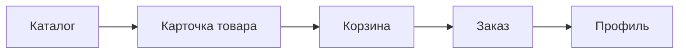

# Buyer-critical path (G.3)

Приоритет mobile: **покупательский** сценарий end-to-end. Staff — только web ([`STAFF-WEB-ONLY.md`](STAFF-WEB-ONLY.md)).

## Цепочка



| Шаг | Экран / route | Feature / API |
| --- | ------------- | ------------- |
| 1. Каталог | `/(tabs)/index`, `/(tabs)/catalog` → browser | `useCatalogProductsInfiniteQuery` → `fetchCatalogProductsPage` (`GET /product`) |
| 2. Карточка | `/product/[id]` | `useCatalogProductQuery` → `fetchCatalogProductById` (`GET /product/:id/catalog`) |
| 3. Корзина | `/(tabs)/cart` | `AddToCartButton` → `useCartActions` → `replaceMyCart` (`PUT /cart`) |
| 4. Заказ | `/(tabs)/cart` checkout → `/orders` | `createOrder` (`POST /order`) → `router.replace("/orders")` |
| 5. Профиль | `/(tabs)/profile`, `/profile/edit` | `useAuthSessionQuery` → `fetchAuthMe` (`GET /auth/me`) |

Deep link на товар: `gitorg://product/<id>` → `/product/[id]` (см. `parseAppDeepLink`).

## DoD на каждый экран

- **load** — `ScreenLoadingState` / spinner
- **error** — `ScreenErrorState` + retry
- **empty** — копирайт + CTA (пустая корзина → каталог)
- **guard** — гость: корзина/оформление → login; свой товар не в корзину
- **actions** — add to cart, checkout, edit profile

## Автоматика (ПК)

```powershell
cd mobile
npm run regression:wf72          # статика: routes, API wiring, navigation
npm run smoke:buyer-path         # API smoke (нужен server :4444 + e2e seed)
```

`smoke:buyer-path` повторяет те же HTTP-эндпоинты, что mobile API-слой: каталог → карточка → cart → order → `/auth/me`.

Перед smoke:

```powershell
# server/
node scripts/e2ePlaywrightSeed.js
```

Env (опционально):

| Переменная | Default |
| ---------- | ------- |
| `BUYER_SMOKE_API_URL` | `http://127.0.0.1:4444` |
| `BUYER_SMOKE_EMAIL` | `e2e-buyer@example.com` |
| `BUYER_SMOKE_PASSWORD` | `E2eTestPass12!` |

## Ручной smoke (Samsung / Expo web)

Предусловия: `server` `:4444`, `mobile/.env` → LAN IP, buyer-аккаунт.

- [ ] `/(tabs)/index` — список товаров, поиск, chips, tap → карточка
- [ ] `/(tabs)/catalog` → tile → фильтр на ленте
- [ ] `/product/[id]` — media, dock «В корзину», stepper qty
- [ ] `/(tabs)/cart` — строки, итого, адрес, оплата → submit
- [ ] `/orders` — новый заказ в списке, tap на товар → карточка
- [ ] `/(tabs)/profile` — overview, pull-to-refresh session
- [ ] `/profile/edit` — сохранить поля, аватар upload

## Вне scope G.3 (не блокируют релиз buyer)

- Staff hub (G.1 → web)
- Seller create/edit (secondary)
- Stories, raffles, auction/installment tabs (расширения карточки)

См. также: [`docs/quality/client-mobile-consolidation-audit.md`](../../docs/quality/client-mobile-consolidation-audit.md) §6, [`docs/clients/mobile-development.md`](../../docs/clients/mobile-development.md) § WF-7.2.
